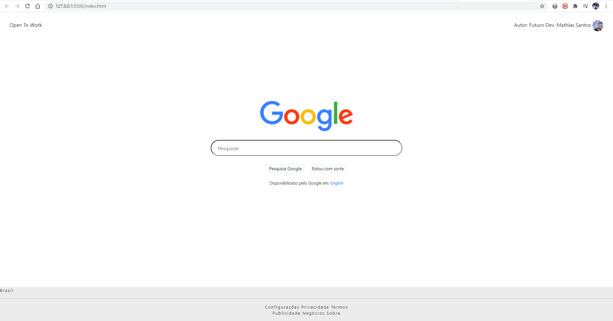

# Página inicial do Google

Trata-se de um clone da página inicial do Google, onde eu utilizo as tecnologias HTML5, CSS e Bootstrap.

O projeto é composto por 2 páginas, a interface principal e a secundária que pode ser acessada ao clicar no button "criar conta" abaixo da barra de pesquisa. Nesta guia será disponibilizado um breve formulário de cadastro para abertura de contas. 

<h3>Página ainda em construção...</h3>

<b>Img-1:</b> Página principal

<b>Img-2:</b> Página de cadastro

